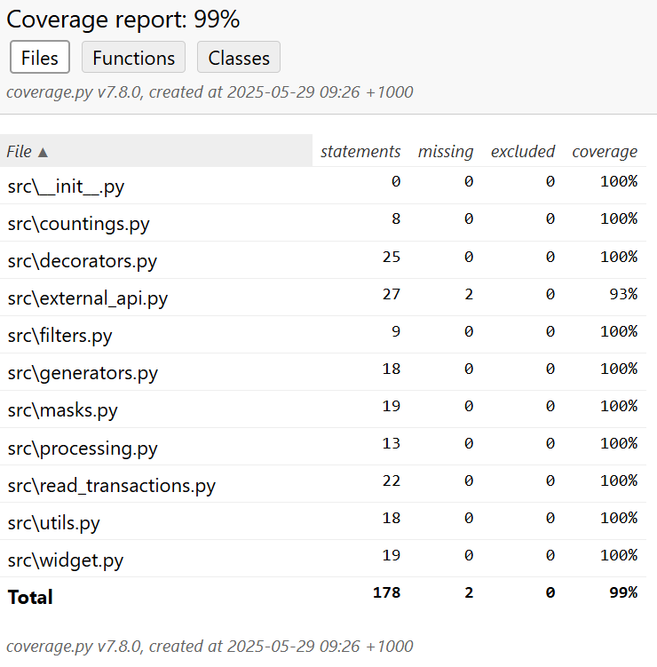

# mod_9

Учебный проект серверная часть виджета банковских операций клиента
***

### Описание модулей

1. Модуль "masks" предоставляет функции для маскировки номеров банковских карт и счетов.
2. Модуль "widget" предоставляет функции для обработки информации как о картах, так и о счетах.
3. Модуль "processing" содержит новые функции обработки данных по ключу и сортировки по дате.
4. Модуль "generators" содержит функции для работы с массивами транзакций.  
5. Модуль "read_transactions" предоставляет функции для считывания финансовых операций из CSV- и XLSX-файлов.
6. Модуль "decorators" обеспечивает более глубокий контроль и анализ поведения программы в процессе ее выполнения.  
7. В модулях "utils" и "external_api" реализован функционал конвертации валютю.  
8. В модуле "filters" реализована функция для поиска в списке словарей операций по заданной строке.  
9. Модуль "countings" предоставляет функцию для подсчета количества банковских операций определенного типа.

---

### Установка и использование

- Установите [Python](https://www.python.org/downloads/)
- Установить менеджер пакетов poetry при помощи pip:

```
pip install poetry
```

- Клонируйте проект с репозитория GitHub:

```
git clone https://github.com/Alex7270/mod10.git
```

- Установите зависимости:

```
poetry update
```

- Запустите main.py:

```
python main.py
```

***

### Примеры использования

```Python 
from pprint import pprint

from src.generators import card_number_generator, filter_by_currency, transaction_descriptions, transactions
from src.processing import filter_by_state, sort_by_date
from src.read_transactions import read_transactions_csv, read_transactions_xlsx
from src.utils import get_transaction
from src.widget import get_date, mask_account_card


def main() -> None:
  print(mask_account_card("Maestro 1596837868705199"))

  print(mask_account_card("Счет 64686473678894779589"))

  print(mask_account_card("MasterCard 7158300734726758"))

  print(mask_account_card("Счет 35383033474447895560"))

  print(mask_account_card("Visa Classic 6831982476737658"))

  print(mask_account_card("Visa Platinum 8990922113665229"))

  print(mask_account_card("Visa Gold 5999414228426353"))

  print(mask_account_card("Счет 73654108430135874305"))

  print(get_date("2024-03-11T02:26:18.671407"))

  print(
    filter_by_state(
      [
        {"id": 41428829, "state": "EXECUTED", "date": "2019-07-03T18:35:29.512364"},
        {"id": 939719570, "state": "EXECUTED", "date": "2018-06-30T02:08:58.425572"},
        {"id": 594226727, "state": "CANCELED", "date": "2018-09-12T21:27:25.241689"},
        {"id": 615064591, "state": "CANCELED", "date": "2018-10-14T08:21:33.419441"},
      ]
    )
  )

  print(
    sort_by_date(
      [
        {"id": 41428829, "state": "EXECUTED", "date": "2019-07-03T18:35:29.512364"},
        {"id": 939719570, "state": "EXECUTED", "date": "2018-06-30T02:08:58.425572"},
        {"id": 594226727, "state": "CANCELED", "date": "2018-09-12T21:27:25.241689"},
        {"id": 615064591, "state": "CANCELED", "date": "2018-10-14T08:21:33.419441"},
      ]
    )
  )

  print()

  usd_transactions = filter_by_currency(transactions, "USD")
  for i in usd_transactions:
    print(i)

  print()

  rub_transactions = filter_by_currency(transactions, "RUB")
  for i in rub_transactions:
    print(i)

  print()

  descriptions = transaction_descriptions(transactions)
  for i in descriptions:
    print(i)

  print()

  for card_number in card_number_generator(1, 5):
    print(card_number)

  print()

  get_transaction("data/operations.json")

  print()

  pprint(read_transactions_csv("data/transactions.csv"), indent=4, sort_dicts=False)

  print()

  pprint(read_transactions_xlsx("data/transactions_excel.xlsx"), indent=4, sort_dicts=False)


if __name__ == "__main__":
  main()
```

#### Результат работы

Maestro 1596 83** **** 5199  
Счет \*\*9589  
MasterCard 7158 30** **** 6758  
Счет \*\*5560  
Visa Classic 6831 98** **** 7658  
Visa Platinum 8990 92** **** 5229  
Visa Gold 5999 41** **** 6353  
Счет **4305  
11.03.2024   
[{'id': 41428829, 'state': 'EXECUTED', 'date': '2019-07-03T18:35:29.512364'}, {'id': 939719570, 'state': 'EXECUTED', 'date': '2018-06-30T02:08:58.425572'}]
[{'id': 41428829, 'state': 'EXECUTED', 'date': '2019-07-03T18:35:29.512364'}, {'id': 615064591, 'state': 'CANCELED', 'date': '2018-10-14T08:21:33.419441'}, {'id': 594226727, 'state': 'CANCELED', 'date': '2018-09-12T21:27:25.241689'}, {'id': 939719570, 'state': 'EXECUTED', 'date': '2018-06-30T02:08:58.425572'}]

{'id': 939719570, 'state': 'EXECUTED', 'date': '2018-06-30T02:08:58.425572', 'operationAmount': {'amount': '9824.07', '
currency': {'name': 'USD', 'code': 'USD'}}, 'description': 'Перевод организации', 'from': 'Счет 75106830613657916952', '
to': 'Счет 11776614605963066702'}
{'id': 142264268, 'state': 'EXECUTED', 'date': '2019-04-04T23:20:05.206878', 'operationAmount': {'amount': '79114.93', '
currency': {'name': 'USD', 'code': 'USD'}}, 'description': 'Перевод со счета на счет', 'from': 'Счет
19708645243227258542', 'to': 'Счет 75651667383060284188'}
{'id': 895315941, 'state': 'EXECUTED', 'date': '2018-08-19T04:27:37.904916', 'operationAmount': {'amount': '56883.54', '
currency': {'name': 'USD', 'code': 'USD'}}, 'description': 'Перевод с карты на карту', 'from': 'Visa Classic
6831982476737658', 'to': 'Visa Platinum 8990922113665229'}

{'id': 873106923, 'state': 'EXECUTED', 'date': '2019-03-23T01:09:46.296404', 'operationAmount': {'amount': '43318.34', '
currency': {'name': 'руб.', 'code': 'RUB'}}, 'description': 'Перевод со счета на счет', 'from': 'Счет
44812258784861134719', 'to': 'Счет 74489636417521191160'}
{'id': 594226727, 'state': 'CANCELED', 'date': '2018-09-12T21:27:25.241689', 'operationAmount': {'amount': '67314.70', '
currency': {'name': 'руб.', 'code': 'RUB'}}, 'description': 'Перевод организации', 'from': 'Visa Platinum
1246377376343588', 'to': 'Счет 14211924144426031657'}

Перевод организации  
Перевод со счета на счет  
Перевод со счета на счет  
Перевод с карты на карту  
Перевод организации

##### Результат работы функции "card_number_generator", обернутой декоратором "log"

Начало работы функции: 2025-05-14 19:11:23

Имя функции: card_number_generator

    Функция выдает номера банковских карт в формате XXXX XXXX XXXX XXXX
    :param start: int
    :param stop: int
    :return: Generator[Any, Any, Any]

Аргументы функции args: (1, 5); kwargs: {}

Окончание работы функции: 2025-05-14 19:11:23

Результат работы функции ОК:
<generator object card_number_generator at 0x000001DD88F78BF0>

0000 0000 0000 0001  
0000 0000 0000 0002  
0000 0000 0000 0003  
0000 0000 0000 0004  
0000 0000 0000 0005  

##### Результат работы модуля read_transaction  

[   {   'id': 650703.0,
        'state': 'EXECUTED',
        'date': '2023-09-05T11:30:32Z',
        'amount': 16210.0,
        'currency_name': 'Sol',
        'currency_code': 'PEN',
        'from': 'Счет 58803664561298323391',
        'to': 'Счет 39745660563456619397',
        'description': 'Перевод организации'},
    {   'id': 3598919.0,
        'state': 'EXECUTED',
        'date': '2020-12-06T23:00:58Z',
        'amount': 29740.0,
        'currency_name': 'Peso',
        'currency_code': 'COP',
        'from': 'Discover 3172601889670065',
        'to': 'Discover 0720428384694643',
        'description': 'Перевод с карты на карту'}]

[   {   'id': 650703.0,
        'state': 'EXECUTED',
        'date': '2023-09-05T11:30:32Z',
        'amount': 16210.0,
        'currency_name': 'Sol',
        'currency_code': 'PEN',
        'from': 'Счет 58803664561298323391',
        'to': 'Счет 39745660563456619397',
        'description': 'Перевод организации'},
    {   'id': 3598919.0,
        'state': 'EXECUTED',
        'date': '2020-12-06T23:00:58Z',
        'amount': 29740.0,
        'currency_name': 'Peso',
        'currency_code': 'COP',
        'from': 'Discover 3172601889670065',
        'to': 'Discover 0720428384694643',
        'description': 'Перевод с карты на карту'}]

***

### Тестирование

- Установите через `Poetry` `Pytest`:

```commandline
poetry add --group dev pytest
``` 

- Установите библиотеку `pytest-cov`:

```commandline
poetry add --group dev pytest-cov
```
- Установите библиотеку `requests`:
```commandline
poetry add requests
```
- Установите библиотеку python-dotenv:
```commandline
poetry add python-dotenv
```
- Установите библиотеку pandas:
```commandline
poetry add pandas
```


- Чтобы запустить тесты с оценкой покрытия, можно воспользоваться следующими командами:  
  `pytest --cov`  — при активированном виртуальном окружении.  
  `poetry run pytest --cov` — через poetry.  
  `pytest --cov=src --cov-report=html` — чтобы сгенерировать отчет о покрытии в HTML-формате.   
  где `src` — пакет c модулями, которые тестируем.   
  Отчёт будет сгенерирован в папке `htmlcov` и храниться в файле с названием `index.html`.

- Oтчёт в HTML будет выглядеть следующим образом:

    
Произведены позитивные и негативные тесты для всех функций модулей `masks`, `widget`,`processing`,`generators`, `decorators`, `utils`, `external_api`, `read_transactions`, `filters`, `countings` .   
Тестами покрыто 99% кода

---

### Документация и ссылки

При необходимости установите [PyCharm Community Edition
](https://www.jetbrains.com/pycharm/download/)


---

### Лицензия

---

